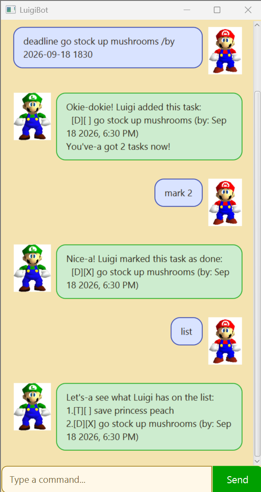

# LuigiBot User Guide

LuigiBot is a Luigi-themed task manager that keeps your todos, deadlines,
and events in one place. Mamma mia, staying organized has never been this
green!



## Quick start

1. Install Java 25.
1. Download `luigibot.jar` and place it in an empty folder.
1. Open a terminal in that folder.
1. Run `java -jar luigibot.jar`.

LuigiBot automatically creates `data/luigibot.txt` beside the JAR and saves
the task list whenever it changes. The saved tasks are loaded the next time
LuigiBot starts.

## Command format

- Enter commands in lowercase.
- Enter dates and times as `yyyy-MM-dd HHmm`, such as `2026-09-18 1830`.
- Use the task numbers shown by `list` when marking, unmarking, or deleting.
- Task descriptions cannot contain the `|` symbol because LuigiBot uses it
  when saving tasks.

## Understanding the task list

| Symbol | Meaning |
| --- | --- |
| `[T]` | Todo |
| `[D]` | Deadline |
| `[E]` | Event |
| `[ ]` | Task is not done |
| `[X]` | Task is done |

## Adding tasks

### Add a todo

Use `todo DESCRIPTION` for a task without a date or time.

```text
todo borrow book
```

### Add a deadline

Use `deadline DESCRIPTION /by DATE_TIME` for a task that must be completed
by a specific time.

```text
deadline submit report /by 2026-09-18 1830
```

LuigiBot displays this date as `Sep 18 2026, 6:30 PM`.

### Add an event

Use `event DESCRIPTION /from START /to END` for an activity with a start and
end time.

```text
event project meeting /from 2026-09-18 1400 /to 2026-09-18 1600
```

The event must end after it starts. LuigiBot also refuses to add an event
that overlaps an existing event and shows which event caused the clash.

## Managing tasks

| Action | Command | Example |
| --- | --- | --- |
| Show every task | `list` | `list` |
| Mark a task as done | `mark TASK_NUMBER` | `mark 2` |
| Mark a task as not done | `unmark TASK_NUMBER` | `unmark 2` |
| Delete a task | `delete TASK_NUMBER` | `delete 2` |

Task numbers can change after deletion, so use `list` before another
numbered command if you are unsure.

## Finding tasks

### Find by keyword

Use `find KEYWORD` to find task descriptions containing the keyword. The
search ignores capitalization.

```text
find book
```

### Find by date

Use `on DATE` to show deadlines and events occurring on a date. Todos do not
appear because they have no date.

```text
on 2026-09-18
```

For an event spanning multiple dates, LuigiBot includes it on every date it
overlaps.

## Exiting LuigiBot

Use `bye` to say goodbye and close LuigiBot.

```text
bye
```

## If something goes wrong

LuigiBot explains invalid commands without closing the application. Check
that required markers such as `/by`, `/from`, and `/to` are present, dates
use the documented format, and task numbers appear in the current list.

If the data folder or file does not exist, LuigiBot creates it when a task is
first saved. Invalid saved records are skipped so the remaining tasks can
still be loaded.

## Acknowledgements

- The JavaFX GUI structure was adapted from the
  [SE-EDU JavaFX tutorial](https://se-education.org/guides/tutorials/javaFxPart1.html).
- The Checkstyle configuration was adapted from
  [AddressBook Level 3](https://github.com/se-edu/addressbook-level3/tree/master/config/checkstyle).
- Luigi and Mario are characters owned by Nintendo. Their images are used in
  this project for educational purposes.
